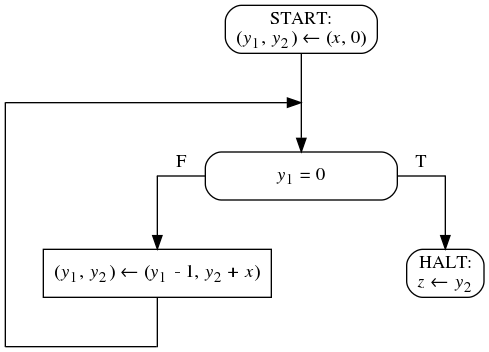

1. Запишите блок-схему с 1 входной переменной, вычисляющей
   ее факториал.

1. Запишите блок-схему с 2 входными переменными, вычисляющую
   количество простых чисел между ними.

1. На рисунке изображена блок-схема, приведены несколько спецификаций.
   Домены всех переменных - множество всех целых чисел. Ответьте
   на вопрос про каждую из спецификаций, является ли эта блок-схема
   частично корректной относительно неё?

    1. <code>&straightphi;(x) &equiv; x &ge; 0</code>, <code>&psi;(x, z) &equiv; z = x&sup2;</code>
    1. <code>&straightphi;(x) &equiv; T</code>, <code>&psi;(x, z) &equiv; z = x&sup2;</code>
    1. <code>&straightphi;(x) &equiv; |x| > 10</code>, <code>&psi;(x, z) &equiv; |z| > 100</code>
    1. <code>&straightphi;(x) &equiv; x > 0</code>, <code>&psi;(x, z) &equiv; z > x</code>
    1. <code>&straightphi;(x) &equiv; x &ge; 0</code>, <code>&psi;(x, z) &equiv; z &ge; x</code>

1. Для каждой приведенной ниже спецификации напишите блок-схемы
   с указанными ниже свойствами, если они существуют. Домен всех
   входных и выходных переменных - множество всех целых чисел.

    - блок-схема, не являющая частично корректной относительно
      данной спецификации;

    - блок-схема, являющаяся частично, но не полностью корректной
      относительно данной спецификации, при этом блок-схема должна
      завершаться на всем подмножестве входного домена, для которого
      существует элемент выходного домена, удовлетворяющий постусловию;

    - блок-схема, являющаяся полностью корректной относительно данной спецификации.

    1. <code>&straightphi;(x&#8321;, x&#8322;) &equiv; x&#8321; > x&#8322; &ge; 0</code>,
       <code>&psi;(x&#8321;, x&#8322;, z&#8321;, z&#8322;) &equiv; z&#8321; > x&#8321; > z&#8322; > x&#8322;</code>

    1. <code>&straightphi;(x&#8321;, x&#8322;) &equiv; 0 > x&#8321; > x&#8322;</code>,
       <code>&psi;(x&#8321;, x&#8322;, z&#8321;, z&#8322;) &equiv; x&#8321;&sup2; > z&#8321; > x&#8322;&sup2; > z&#8322;</code>

    1. <code>&straightphi;(x&#8321;, x&#8322;) &equiv; x&#8321; > x&#8322; &ge; 0</code>,
       <code>&psi;(x&#8321;, x&#8322;, z&#8321;, z&#8322;) &equiv; x&#8322;&sup2; > z&#8321; > x&#8321;&sup2; > z&#8322;</code>

    1. <code>&straightphi;(x&#8321;) &equiv; x&#8321; > 0</code>,
       <code>&psi;(x&#8321;, z&#8321;, z&#8322;) &equiv; z&#8321; = x&#8321; * z&#8322; &and; z&#8321; < z&#8322;</code>

1. Докажите или опровергните утверждения о {частичной} или &#10092;полной&#10093; корректности.
   Заглавными буквами обозначены блок-схемы, строчными - логические формулы.

    1. <code>&forall; a &forall; P &exist; b such as {a}P{b} &rArr; {b}P{a}</code>

    1. <code>&forall; a &forall; P &exist; b such as &#10092;a&#10093;P&#10092;b&#10093; &rArr; {b}P{a}</code>

    1. <code>&forall; P &exist; a &exist; b such as &#10092;a&#10093;P&#10092;b&#10093;</code>

    1. <code>&forall; P &exist; a &exist; b such as {a}P{b} &and; &not; &#10092;a&#10093;P&#10092;b&#10093;</code>

## Упражнения для выполнения на компьютере

Установите инструменты Frama-C, Why3, AstraVer и солверы
согласно [инструкции](https://forge.ispras.ru/projects/astraver/wiki).
Устанавливать Coq и CoqIDE не нужно. Для установки солвера CVC4 есть
[инструкция](/cvc4).

Познакомьтесь с языком Why3 по [этому документу](https://web.archive.org/web/20171208230848/http://why3.lri.fr/manual.pdf).
Обратите внимание, что в нем описывается язык версии 0.88.2, а наши
инструменты поддерживают версию 0.87. Часть синтаксиса изменилась.

Ниже описаны программы `P1` и `P2` и требования `T1` и `T2`.

0. Реализуйте (на листочке) программы `P1` и `P2` на языке Си как функции.
   Учтите, что в языке Си есть понятие неопределенного поведения
   (undefined behavior), к которому относится и знаковое целочисленное
   переполнение. Исходный код на языке Си пишется в предположении, что
   неопределенного поведения не происходит. Поэтому не нужно проверять
   аргументы операций на переполнение и зацикливаться при неподходящих
   аргументах.

1. Промоделируйте (на листочке) программы `P1` и `P2` в виде блок-схем.
   Все переменные блок-схем должны иметь домен всех целых чисел.
   Модель должна быть составлена по программе <<механически>>,
   <<синтаксически>>, т.е. ее соответствие программе должно быть очевидно.

2. Промоделируйте (на листочке) требования `T1` и `T2` в виде предусловий
   и постусловий.

3. Определите все пары программ и требований, которые находятся в отношении
   частичной корректности. Докажите эти факты по определеню (на листочке).

4. Определите все пары программ и требований, которые находятся в отношении
   полной корректности. Докажите эти факты по определению (на листочке).

5. Оформите каждое доказательство в виде теории Why3. Цель теории -- доказать
   нужное отношение соответствия. Теория состоит из целей, являющихся
   доказываемыми определениями корректности. Докажите теории в Why3IDE.

Входом _Программы P1_ являются три целых числа, выходом -- одно число.
Программа отнимает от первого числа третье и затем прибавляет к полученному
второе число. Так получается выходное число.

Все вычисления делаются в машинной арифметике в целых числах от -231 до 231 - 1
(нет вычислений в других типах целых чисел).
Сумма и вычитание -- это бинарные операции над такими
целыми числами, их результаты -- такие же числа. Операции не определены для
случая переполнения: каждое сложение и вычитание в программе на Си должно
моделироваться как проверка результата и зацикливание в случае переполнения.

Входы и выходы _Программы Р2_ те же, что и у _Программа Р1_. Ее цель --
вычислить то же выражение. Она сравнивает значения входных чисел и выбирает
такой порядок суммы и вычитания, чтобы не случилось переполнение всегда,
когда лишь результат всего искомого
выражения представим данными целыми числами. Попробуйте самостоятельно
составить такую программу. Она использует ту же машинную арифметику, что и
_Программа Р1_.

_Требования Т1_ применимы к программам с тремя входными переменными
(назовем их _x1_, _x2_, _x3_) и одной выходной переменной. Домены всех
переменных -- множество всех целых чисел. Программа должна вычислять
значение выражения _x1_ + _x2_ - _x3_.
Программа не должна зацикливаться или вычислять другое значение, если
значения всех входных переменных принадлежат множеству от
-231 до 231 - 1 включительно,
а значения выражений _x1_ - _x3_ и _x1_ + _x2_ - _x3_
представимы в типе указанных выше ограниченных целых чисел.

_Требования Т2_ применимы к программам с тремя входными переменными
(назовем их _x1_, _x2_, _x3_) и одной выходной переменной. Домены всех
переменных -- множество всех целых чисел. Программа вычисляет значение
выражения _x1_ + _x2_ - _x3_.
Программа не должна зацикливаться или вычислять другое значение, если
значения входных переменных принадлежат множеству
от -231 до 231 - 1 включительно,
а значение выражения _x1_ + _x2_ - _x3_ представимо
в типе указанных выше ограниченных целых чисел.

