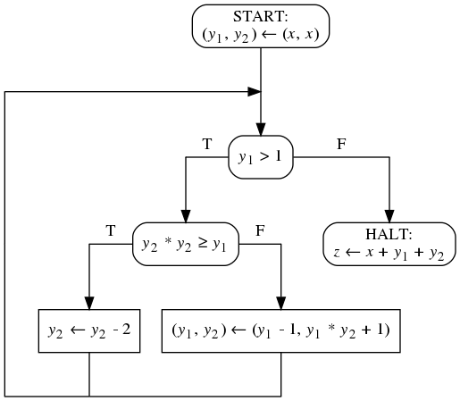
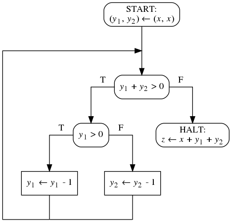
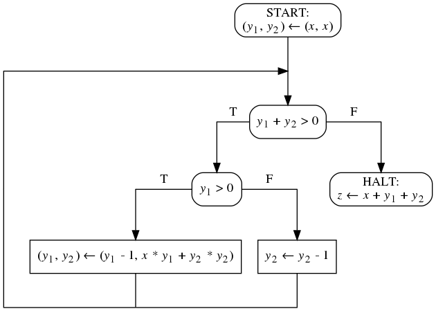
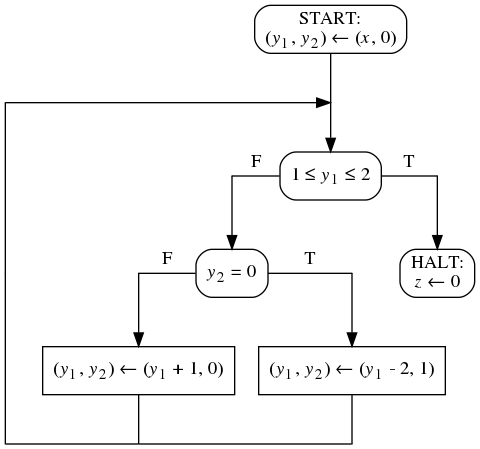
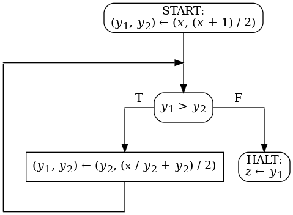

1. Дана блок-схема над 1 входной, 2 промежуточными
   и 1 выходной переменной. Домены всех переменных - множество
   всех целых чисел. Дана спецификация над этими же
   переменными. При помощи методов Флойда докажите, что
   блок-схема полностью корректна относительно спецификации.

   <code>&straightphi;(x) &equiv; x > 0</code>

   <code>&psi;(x, z) &equiv; z > x</code>

   

1. Дана блок-схема над 1 входной, 2 промежуточными
   переменными. Домены всех переменных - множество всех целых
   чисел. Дано предусловие над этими же переменными.
   При помощи методов Флойда докажите, что блок-схема
   завершается на этом предусловии.

   <code>&straightphi;(x) &equiv; x &ge; 0</code>

   

1. Дана блок-схема над 1 входной, 2 промежуточными
   переменными. Домены всех переменных - множество всех
   целых чисел. Дано предусловие над этими же переменными.
   При помощи методов Флойда докажите, что блок-схема
   завершается на этом предусловии.

   <code>&straightphi;(x) &equiv; x &ge; 0</code>

   

1. Дана блок-схема над 1 входной, 2 промежуточными
   переменными. Домены всех переменных - множество всех
   целых чисел. Дано предусловие над этими же переменными.
   При помощи методов Флойда докажите, что блок-схема
   завершается на этом предусловии.

   <code>&straightphi;(x) &equiv; x &gt; 0</code>

   

1. Дана блок-схема над 1 входной, 2 промежуточными
   и 1 выходной переменными. Домены всех переменных --- множество
   всех целых чисел. Дана спецификация над этими же переменными.
   При помощи методов Флойда докажите, что блок-схема полностью
   корректна относительно этой спецификации.

   <code>&straightphi;(x) &equiv; x &ge; 0</code>

   <code>&psi;(x, z) &equiv; z&#178; &le; x &lt; (z + 1)&#178;</code>

   

1. Пусть есть блок-схема и предусловие и завершаемость
   блок-схемы на этом предусловии доказана по методу
   фундированных множеств с выбранным фундированным
   множеством `(U, a)` и выбранными оценочными функциями
   ui. Возможно ли доказать завершаемость
   тем же методом с использованием тех же точек сечения и
   _тождественных_ функций в качестве оценочных? Если да,
   то сделайте это на каком-нибудь примере и для всех случаев.

## Упражнения для выполнения на компьютере

1. Дана блок-схема и спецификация к ней. При помощи
   метода фундированных множеств докажите завершаемость
   блок-схемы относительно спецификации.

2. Оформите доказательство в виде теории Why3. Каждому условию
   верификации будет соответствовать своя цель теории.
   Фундированное множество, индуктивные утверждения и оценочные функции
   оформите в виде отдельных сущностей теории. В случае _нестандартного_
   фундированного множества, добавьте цели, доказывающие его фундированность.
   Докажите теорию в Why3IDE. 

Множество переменных <code>V = { <i>x</i>, <i>y</i>1,
<i>y</i>2, <i>y</i>3, <i>z</i> }</code> состоит
из одной входной, трех промежуточных и одной выходной переменных.
Доменом всех переменных является множество всех целых чисел. На рисунке
представлена блок-схема программы над множеством переменных <code>V</code>.

<code>&straightphi;(x) &equiv; x &gt; 1</code>

