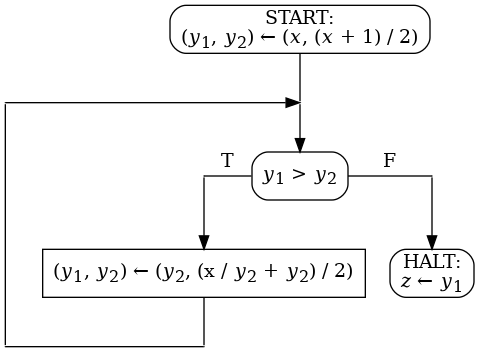

1. В системе есть _процессы_, которые пытаются войти в
   _критическую секцию_. В каждый момент времени в ней
   может находиться не более 1 процесса. Опишите модель со
   следующими событиями и докажите ее корректность в Rodin.

   - `request(p)` --- запрос на вход в критическую секцию от
     процесса `p`

   - `enter(p)` --- вход процесса `p` в критическую секцию

   - `leave(p)` --- выход процесса `p` из критической секции

1. В системе есть _производители_ и _потребители_, которые
   используют общий буфер размера не более _MAX_. Буфер
   не может переполняться. Опишите
   модель со следующими событиями и докажите ее корректность
   (структура буфера не моделируется):

   - `produce(n)` --- добавление `n` в буфер

   - `consume(n)` --- извлечение `n` из буфера

1. В системе есть _производители_ и _потребители_, которые
   используют общий буфер размера не более _MAX_. Буфер
   не может переполняться. Процесс не может одновременно
   выполнять операцию производства и операцию потребления. Опишите
   модель со следующими событиями и докажите ее корректность
   (структура буфера не моделируется):

   - `produce_request(p, n)` --- запрос на добавление `n` в буфер
     от процесса `p`

   - `produce_complete(p)` --- выполнение запроса на добавление
     от процесса `p`

   - `consume_request(p, n)` --- запрос на извлечение `n` из буфера
     от процесса `p`

   - `consume_complete(p)` --- выполнение запроса на извлечение
     от потребителя `p`

1. На железнодорожном переезде установлен _шлагбаум_. Шлагбаум
   может быть в одном из следующих состояний: `open`, `closed`.
   _Поезд_ может быть в одном из следующих состояний: `far`,
   `near`, `on`, `gone`. Шлагбаум должен быть
   закрыт, когда по переезду передвигается поезд (`on`). Опишите модель
   со следующими событиями и докажите ее корректность:

   - `train_approaches` --- поезд подходит к переезду

   - `train_enters` --- поезд начинает движение по переезду

   - `train_leaves` --- поезд завершил движение по переезду

   - `close_gate` --- закрыть шлагбаум

   - `open_gate` --- открыть шлагбаум

1. В банке есть несколько _счетов_, каждому счету сопоставлена
   некоторая натуральная сумма (<code>balance &#x2208; ACCOUNTS +-> NAT</code>).
   Между счетами можно совершать переводы. При этом суммарный
   баланс всех счетов должен сохраниться. Опишите модель
   с единственным событием и докажите ее корректность:
   `transfer(from, to, amount)` --- перевод `amount` со счета
   `from` на счет `to`.

   _Примечание_: в Event-B нет встроенной суммы, для ее определения
   можно использовать такой набор аксиом: сумма от пустого
   множества, сумма от множества из 1 элемента, сумма объединения
   непересекающихся множеств.

1. Нужно разработать двухуровневую модель неиерархической файловой
   системы. В ней есть именованные файлы и пользователи.
   В системе не может быть двух разных файлов с одним и тем же именем.

   <ol type="a">
   <li markdown="1">

   На первом уровне промоделируйте файлы без пользователей.  
   Список событий:

   - `create_file(name, file)` --- создать файл `file` с именем `name`

   - `get_all_names(name, names)` --- все имена файла с именем `name`

   - `remove_name(name)` --- удалить имя `name` (и файл, если у него не осталось имён)

   </li>

   <li markdown="1">

   На втором уровне добавьте пользователей, у каждого файла
   должен быть ровно один пользователь-владелец, менять владельца
   файла может только его текущий владелец. 
   Список событий:

   - `create_user(user)` --- создать пользователя `user`

   - `create_file(name, file, user)` --- добавить владельца в событие
     создания файла из предыдущего уровня

   - `change_owner(name, user, new_owner)` --- поменять владельца файла
     с именем `name` на `new_owner`, операцию запрашивает пользователь `user`
 
   </li>
   </ol>

1. Нужно разработать иерархическую модель файловой системы, обеспечивающую
   целостность.

   <ol type="a">
   <li markdown="1">

   На первом уровне нужно промоделировать пользователей, группы пользователей
   и процессы. Каждый пользователь принадлежит хотя бы к одной из групп.
   Каждый процесс имеет эффективного пользователя и эффективную группу.  
   События:

   - `create_group(group)` --- создать группу `group`

   - `create_user(user, groups)` --- создать пользователя `user` и поместить
     его в группы `groups`

   - `create_process(proc, user, group)` --- создать процесс `proc` с эффективным
     пользователем `user` и эффективной группой `group`

   </li>
   <li markdown="1">

   На втором уровне нужно промоделировать файлы (среди которых есть директории),
   причем директории образуют иерархию. Имена файлов и иерархия --- как в Linux.
   Жесткие ссылки должны поддерживаться, символические --- нет.
   Каждый файл имеет пользователя-владельца и группу-владельца. 
   События:

   - `create_regular_file(parent, name, proc, file)` --- создать регулярный файл
     `file` с именем `name` в директории `parent`, операцию запрашивает процесс `proc`

   - `create_folder(parent, name, proc, folder)` --- то же для директории

   </li>
   <li markdown="1">
   
   На третьем уровне нужно добавить целостность. Она представляет собой битовый
   вектор (промоделировать множеством из не более 4-х битов). Целостность должна
   быть у файлов и процессов. Все биты целостности файла должны быть в
   целостности ее родительской директории. Файл получает целостность процесса,
   который его создает. Права на запись в родительскую директорию имеют только
   те процессы, чья целостность включает все биты целостности родительской директории.
   Внести изменения в события:

   - `create_process(..., integrity)` --- добавить целостность процесса

   - `create_regular_file` --- проверить права на запись в родительскую
     директорию и создать в ней файл в случае успеха 

   - `create_folder` --- то же для директории

   </li>
   </ol>

1. Добавить в предыдущую модель операцию перемещения (переименования)
   директории. Она переносит своё поддерево на новое пустое место.

## Упражнения для выполнения на компьютере

1. Кофе-автомат готовит кружку вкусного напитка в обмен на монету.
   Он состоит из механизма для приготовления кофе, бака для воды,
   отсека для кофейных зерен, блока из стаканчиков и отсека для
   монет, различных шлангов и блока программного управления.
   На передней панели кофе-автомата расположены щель для монеты, экран с живой
   рекламой и отсек, куда попадает стаканчик с готовым напитком.

   На одну кружку кофе уходит `N` единиц воды, `M` единиц кофейных
   зерен и 1 стаканчик. Бак для воды вмещает до `W` единиц воды.
   Отсек для кофейных зерен вмещает до `C` единиц кофейных зерен.

   Щель для монеты может быть открыта или закрыта. Если не хватает
   ингредиентов или стаканчиков или автомат в данный момент варит
   кофе, щель должна быть закрыта. В остальных случаях она
   должна быть открыта.

   Сзади автомата есть замочная скважина для обслуживающего персонала.
   Используя соответствующий ключ, задняя стенка открывается
   и возможно добавить ингредиенты и забрать монеты.

   Напишите формальную модель кофе-автомата на следующем уровне
   абстракции: моделируется щель, ингредиенты, готовит ли механизм
   кофе. Найдите требования, которые нужно выразить при помощи
   инвариантов. При помощи `Rodin` верифицируйте модель.

1. Дана блок-схема с одной входной переменной, двумя промежуточными
   переменным и одной выходной переменной. Домены всех переменных
   множество всех целых чисел.
   Целочисленное деление <code>a / b</code> определено только для
   тех пар целых чисел <code>(a, b)</code>, в которых <code>a</code>
   неотрицательно, а <code>b</code> положительно.

   Обозначим <code>isqrt(x)</code>
   целочисленный квадратный корень целого неотрицательного <code>x</code>.
   Докажите полную корректность блок-схемы относительно спецификации

   <code>&straightphi;(x) &equiv; x &ge; 0</code>

   <code>&psi;(x, z) &equiv; z = isqrt(x)</code>

   

   Оформите доказательство в виде контекста `Event-B` следующего вида.
   Определите <code>isqrt</code> как константу типа функция. В виде
   аксиомы, не являющейся теоремой, запишите определение <code>isqrt</code>:
   для всех целых неотрицательных <code>x</code> справедливо неравенство

   <code>isqrt(x) * isqrt(x) &le; x &lt; (isqrt(x) + 1) * (isqrt(x) + 1)</code>.

   Оформите каждое условие верификации как аксиому-теорему.

   Для повышения читабельности можно оформить индуктивное утверждение,
   оценочную функцию и т.п. как еще одни константы аналогично <code>isqrt</code>
   и можно добавлять дополнительные аксиомы-теоремы.

   Докажите все аксиомы-теоремы средствами `Rodin`.
