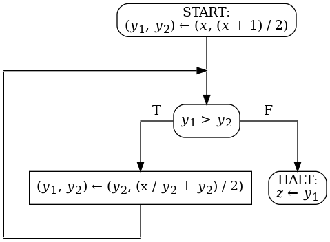

## Задание 3.1

Кофе-автомат готовит кружку вкусного напитка в обмен на монету.
Он состоит из механизма для приготовления кофе, бака для воды,
отсека для кофейных зерен, блока из стаканчиков и отсека для монет, различных шлангов и блока
программного управления.
На передней
панели кофе-автомата расположены щель для монеты, экран с живой
рекламой и отсек, куда
попадает стаканчик с готовым напитком.

На одну кружку кофе уходит `N` единиц воды, `M` единиц кофейных
зерен и 1 стаканчик. Бак для воды вмещает до `W` единиц воды.
Отсек для кофейных зерен вмещает до `C` единиц кофейных зерен.

Щель для монеты может
быть открыта или закрыта. Если не хватает ингредиентов или стаканчиков
или автомат
в данный момент варит кофе, щель закрыта. В остальных случаях
она открыта.

Сзади автомата есть замочная скважина для обслуживающего персонала.
Используя соответствующий ключ, задняя стенка открывается
и возможно добавить ингредиенты и забрать монеты.

Напишите формальную модель кофе-автомата на следующем уровне
абстракции: моделируется щель, ингредиенты, готовит ли механизм
кофе. При помощи `Rodin` верифицируйте модель.

_Прагматика_ Это задание позволяет отработать навыки формального
моделирования на языке `Event-B` и верификации модели в среде `Rodin`.

## Задание 3.2

Дана блок-схема с одной входной переменной, двумя промежуточными
переменным и одной выходной переменной. Домены всех переменных
множество всех целых чисел. 
Целочисленное деление <code>a / b</code> определено только для
тех пар целых чисел <code>(a, b)</code>, в которых <code>a</code>
неотрицательно, а <code>b</code> положительно.

Обозначим <code>isqrt(x)</code>
целочисленный квадратный корень целого неотрицательного <code>x</code>. Докажите полную корректность блок-схемы относительно спецификации 

<code>&straightphi;(x) &equiv; x &ge; 0</code>

<code>&psi;(x, z) &equiv; z = isqrt(x)</code>

Оформите доказательство в виде контекста `Event-B` следующего вида.
Определите <code>isqrt</code> как константу типа функция. В виде
аксиомы, не являющейся теоремой, запишите определение <code>isqrt</code>:
для всех целых неотрицательных <code>x</code> справедливо неравенство

<code>isqrt(x) * isqrt(x) &le; x &lt; (isqrt(x) + 1) * (isqrt(x) + 1)</code>.

Оформите каждое условие верификации как аксиому-теорему.

Для повышения читабельности можно оформить индуктивное утверждение,
оценочную функцию и т.п. как еще одни константы аналогично <code>isqrt</code>
и можно добавлять дополнительные аксиомы-теоремы.

Докажите все аксиомы-теоремы средствами `Rodin`.

_Прагматика_ Это задание позволяет отработать навыки
доказательства условий верификации в среде `Rodin`.

## Задание 3.3

Некоторая операционная система выполняет функции
защиты информации (СЗИ).
СЗИ контролирует осуществление _процессами_ доступа
к _файлам_. Процессы создаются _пользователями_.
При загрузке СЗИ читает _список доступа_. В нем
записано, каким пользователям разрешено иметь доступ
к каким файлам. СЗИ должна следить за соблюдением
списка доступа.

Процесс может открывать и закрывать файлы,
создавать дочерние процессы, а также менять пользователя
процесса и возвращать предыдущего пользователя.
Для работы с системой пользователь должен
залогиниться.

Промоделируйте СЗИ и все перечисленные действия,
верифицируйте модель. В результате верификации обоснуйте,
что модель противоречива. Исправьте модель, чтобы она
при этом не потеряла полезный функционал.

_Прагматика_ Это задание позволяет отработать навыки
анализа формальных моделей.